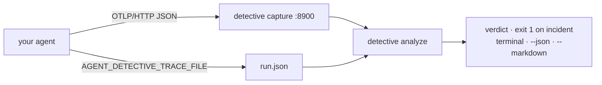
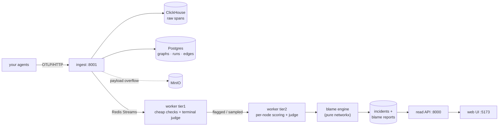

# Agent Detective

[](https://github.com/Thomeras/agent_detective/actions/workflows/ci.yml)
[](LICENSE)
[](pyproject.toml)

**PagerDuty for multi-agent systems.** Ingest standard OpenTelemetry traces,
rebuild the execution graph, and name the first node where quality broke —
the culprit, the propagation path, and the downstream cost. OTEL-native:
any OpenInference / OpenLLMetry instrumented agent works with no code change.

```bash
pip install agent-detective
detective analyze trace.json
```

```
── graph 3f2a91c8  [content-pipeline]
   FAILED  ·  cut_point  ·  confidence 62%

   Origin — where quality broke
     translator

   Defects
     ● Contract breach — translator
       A carried input/output parameter was silently rewritten at translator.
       observation 100% · attribution 92% · channel deterministic
```

## Docs

| You want to… | Read |
|---|---|
| The guided tour — instrumenting, analyzing, CI, machine output | **[docs/usage.md](docs/usage.md)** |
| Connect your own agents (attributes, adapters, SDK) | [docs/instrumentation.md](docs/instrumentation.md) |
| Understand the system design | [docs/architecture.md](docs/architecture.md) |
| What it can and cannot claim today | [docs/capabilities.md](docs/capabilities.md), [docs/trace-requirements.md](docs/trace-requirements.md) |
| The pip distribution's own manual | [packages/detective_cli/README.md](packages/detective_cli/README.md) |
| Benchmark against Who&When failure attribution | [benchmarks/whoandwhen/README.md](benchmarks/whoandwhen/README.md) |

## Quickstart — one run, zero infrastructure



```bash
detective capture --once --out run.json # receive a trace straight from your agent
detective analyze run.json              # the verdict; exit 1 on an incident (CI gate as-is)
detective analyze run.json --markdown   # findings brief for a coding agent
detective doctor run.json               # is the trace even worth trusting?
```

Already instrumented? Point the exporter at it:
`OTEL_EXPORTER_OTLP_PROTOCOL=http/json OTEL_EXPORTER_OTLP_ENDPOINT=http://127.0.0.1:8900`.
Not yet? `detective-sdk` (pure stdlib, zero dependencies) emits the same spans:

```python
from detective_sdk import run

with run("intel", task=user_request) as r:
    with r.step("write") as s:
        s.output = dossier_markdown            # the work, not {"ok": true}
        s.cost(usd=0.03, tokens_in=8_000, tokens_out=900, model="gpt-4o")
```

No database, no broker, and by default no LLM: the deterministic evidence
channel needs nothing but the trace. Set `JUDGE_BASE_URL` / `JUDGE_MODEL`
(any OpenAI-compatible endpoint) to also turn on the per-node quality judge —
without it, nodes report *unscored*, never silently "fine".

## Example: catch a fault in a diamond topology

[examples/diamond_eval.py](examples/diamond_eval.py) instruments a diamond —
one extractor, two parallel writers, one editor — and gates on the verdict.
Each writer declares the facts it was handed as a **contract**; `--inject`
makes the marketing branch silently rewrite the price:

```python
with r.branch("marketing_writer", input=facts) as s:
    s.contract(price=facts["price"], availability=facts["availability"])
    s.output = write_marketing(facts, inject)    # --inject rewrites the price
```

```bash
$ python examples/diamond_eval.py --inject
graph 0a68bb06: cut_point — culprit: marketing_writer    # exit code 1
```

The verdict names the branch that rewrote the fact — not the editor who merged
it downstream — and verifies the breach actually shipped, all with no LLM:

```
FAILED  ·  cut_point  ·  confidence 95%

Origin — where quality broke
  marketing_writer

● Contract breach — marketing_writer
  supporting: contract_breach (rule input_contract:price)
  supporting: breach_propagated at terminal (contract-propagation check on the deliverable)

Deterministic signals
  fail contract_violation (marketing_writer) price: $12/user/month → from $5/user/month
```

Point the same script at the full stack and the graph appears in the web UI:

```bash
AGENT_DETECTIVE_ENDPOINT=http://localhost:8001 python examples/diamond_eval.py --inject
```

<!-- TODO(screenshot): web UI graph view of the injected diamond run -->

## Full stack — continuous ingest, inbox, history

```bash
docker compose up --build                 # infra + ingest + worker + api + web
./demo/run.sh                             # happy-path demo: graph, no incident
./demo/inject_fault.sh && ./demo/run.sh   # a cut_point incident appears
```

Web UI at `:5173`, read API at `:8000`, ingest at `:8001`; the bundled mock
LLM judges, so no external API keys are needed.



The report separates **where quality broke** (origin) from **where it
surfaced** (manifestation), flags rubber-stamping verifiers, and reports
capped, split confidence (observation × attribution). What the trace did not
capture, no analysis can manufacture — absent evidence renders `unverified`,
never `ok`.

## Repository layout

```
packages/
  blame_engine/    pure, I/O-free blame analysis (networkx only)
  otel_mapper/     OTLP span -> AgentRun/Edge mapping (Apache-2.0)
  detective_cli/   the `agent-detective` pip distribution: local mode + CLI
  detective_sdk/   zero-dependency instrumentation helpers
  detective_ci/    deterministic golden replay + pytest plugin
services/          ingest · worker (tier1/tier2 + judge) · read API
db/                Alembic migrations        docker/clickhouse/  ClickHouse init
web/               React + Vite + cytoscape UI
```

## Development

```bash
uv sync --all-packages --all-groups   # install the workspace
./scripts/test.sh                     # every unit suite (mirrors CI)
uv run pytest tests/e2e               # acceptance test (needs a running stack)

for p in blame-engine otel-mapper detective-sdk detective-ci \
         agent-detective-worker agent-detective; do
  uv build --package "$p"             # the pip distributions
done
```

## License

Business Source License 1.1 (see [LICENSE](LICENSE));
`packages/otel_mapper` is Apache-2.0.
